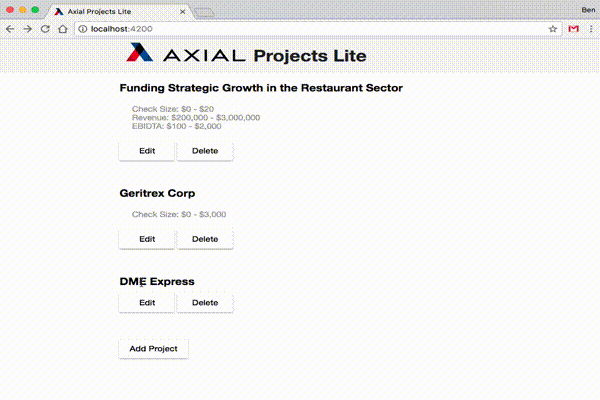

# axl-projects-lite

`axl-projects-lite` is a project meant to simulate a project management application built for [Axial Networks](http://axial.net).

## Usage

If you haven't already, please install [node.js](https://nodejs.org).
You will also need the [angular-cli](https://github.com/angular/angular-cli) project installed, which can be done using the following command:

    npm install -g @angular/cli

Next, install the project dependencies:

    npm install

And boot the application as follows:

    ng serve --open

The application will then be assessible via [http://localhost:4200](http://localhost:4200).

## Testing

Run the tests using the following:

    npm test --watch=false

Note that if you omit `--watch=false` you can continue to develop tests and the code will hot-reload and rerun them.

## License

[ISC](LICENSE.md)

## TODO

* Improve unit test coverage.
* Add end-to-end tests.
* `ProjectService` to display error messages in a useful way -- modal message?
* Navigating away from `ProjectComponent` with unsaved changes causes browser to prompt user to confirm.
* Consider breaking components into their own subdirectories.